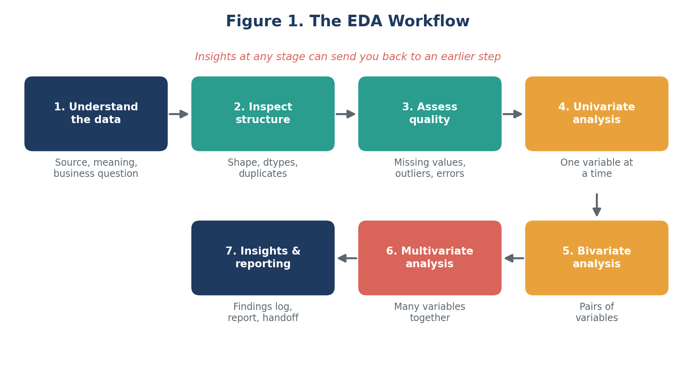
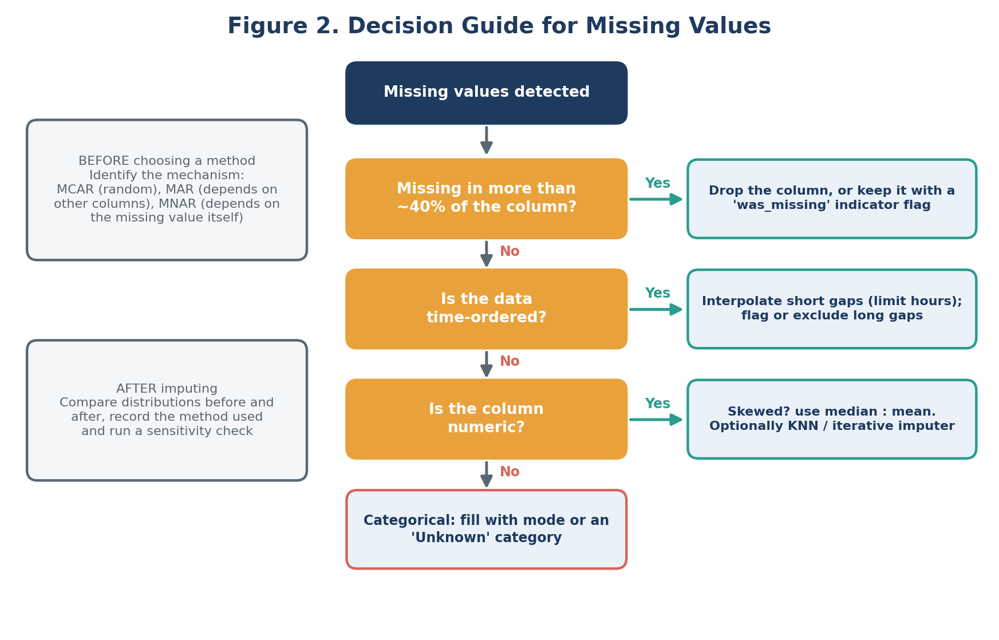
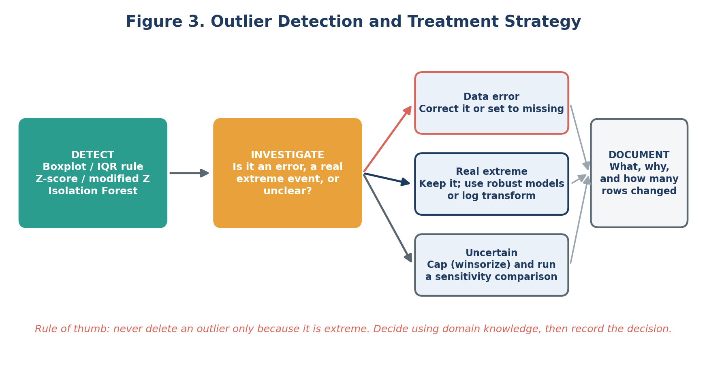
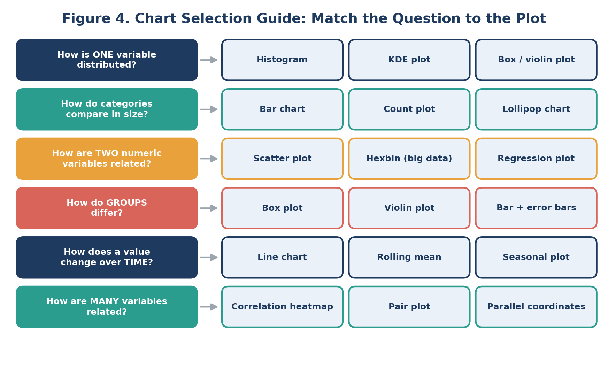
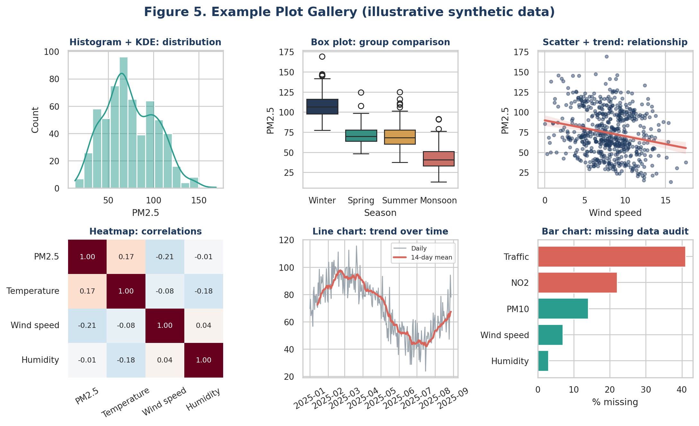
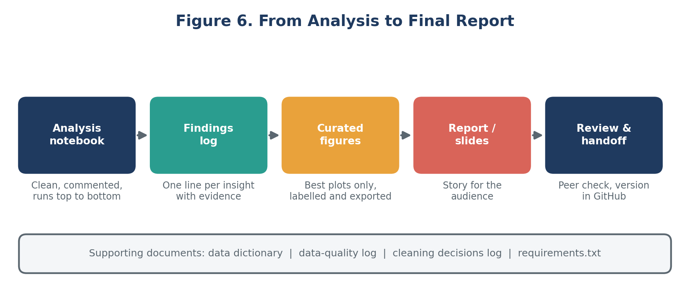

# EDA and Visualization Framework (Python)

Week 2 deliverable: a reusable, step-by-step framework for **Exploratory Data Analysis (EDA)** and
**visualization** that can be applied to any tabular dataset. No dataset is required: the focus is on the
process, techniques, Python tools and reporting plan.

Full document: [`docs/Week2_EDA_Visualization_Framework.docx`](docs/Week2_EDA_Visualization_Framework.docx)

## What the framework covers
- **Introduction to EDA:** what it is, why it matters, and a 7-stage workflow
- **Data types:** numerical, categorical, datetime, text, geospatial, with matching techniques
- **Exploration techniques:** univariate, bivariate and multivariate analysis
- **Data quality:** missing-data mechanisms (MCAR, MAR, MNAR) and outlier detection (IQR, Z-score, Isolation Forest)
- **Visualization strategy:** chart selection guide, plot gallery and design principles
- **Tools:** pandas, NumPy, matplotlib, seaborn, plotly, SciPy, scikit-learn, missingno
- **Reporting plan:** data dictionary, findings log, notebook structure, report and slide outline

## EDA workflow

## Handling missing values

## Outlier strategy

## Choosing the right chart

## Example plot gallery (synthetic data)

## From analysis to report

## Related project
Planned for use in the [Urban Air Quality Forecasting](https://github.com/) project (Week 1 plan).

## Status
Planning phase complete (Week 2). Practical implementation in later weeks.
